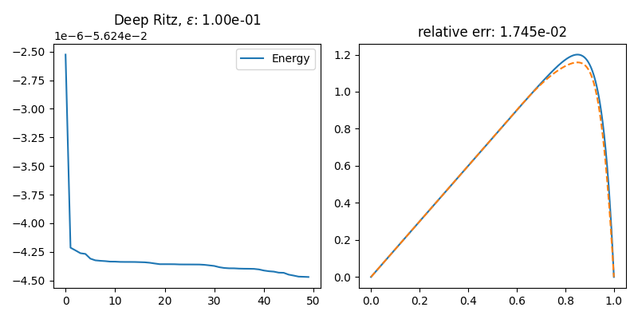
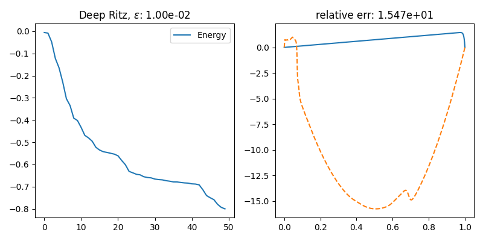
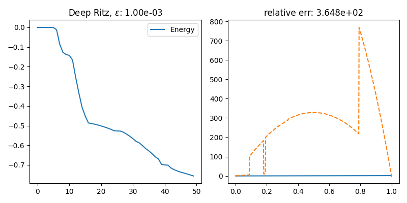
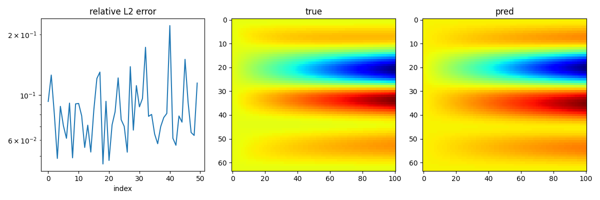

## 3

### a

To apply the Deep Ritz method,
we need to find an appropriate energy functional.

Note that
$$a(u,v) = \int \epsilon u_x v_x - 2u v_x dx$$
is not symmetric, so minimizing
$$u \mapsto 0.5 a(u,u) - \int 3 u dx$$
might be inappropriate.

Instead, we slightly change the equation into
$$-e^{-2x/\epsilon} u_{xx} + \frac{2}{\epsilon} e^{-2x/\epsilon} u_x = \frac{3}{\epsilon} e^{-2x/\epsilon}.$$

Then it is equivalent to 
$$-\partial_x \left(e^{-2x/\epsilon}u_x\right) = \frac{3}{\epsilon} e^{-2x/\epsilon}.$$

Thus we found a symmetric continuous coercive bilinear form
$$a(u,v) = \int e^{-2x/\epsilon}u_x v_x dx,$$
and a continuous linear form
$$L(v) = \int \frac{3}{\epsilon} e^{-2x/\epsilon} v dx.$$

Applying the Deep Ritz method to
$$J(u) = 0.5 a(u,u) - L(u)$$
results in

## 4
